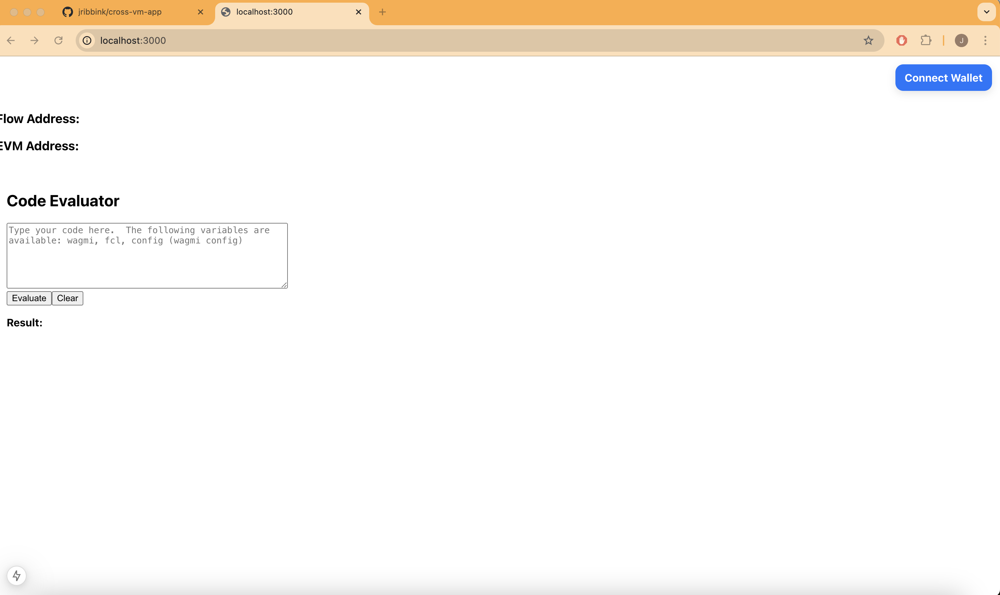

# FCL + RainbowKit + Wagmi Integration Demo

A demonstration of integrating Flow blockchain cross-VM functionality with FCL, RainbowKit, Wagmi, and Next.js, allowing users to connect both EVM and Flow wallets in a single application.



✨ Supercharge Your Apps with Cadence ✨

- 🔗 **Seamless Cross-VM Integration** – Connect Flow and EVM wallets effortlessly.
- 🔥 **Leverage Cadence's Power** – Enhance dApps with composable, atomic interactions.
- 🚀 **Progressive Adoption** – Incrementally integrate Flow’s features without disrupting existing workflows.
- ⚡ **Bundled Transactions** – Execute multiple operations in a single atomic transaction using FCL and Cadence, reducing gas costs and improving efficiency.

## Features

- Connect to Flow and EVM wallets using RainbowKit
- Display connected wallet addresses
- Interactive code evaluation sandbox
- Built with Next.js 15 and React 19

## Prerequisites

- Node.js >= 20.0.0
- Flow Wallet Browser Extension
- An EVM wallet (like MetaMask)

## Getting Started

1. Clone the repository:
   ```bash
   git clone <repository-url>
   ```

2. Install dependencies:
   ```bash
   npm install
   ```
3. Install and build [FCL-JS](https://github.com/onflow/fcl-js) at the path `../fcl-js` (this can be configured in the `package.json` file).

3. Run the development server:
   ```bash
   npm run dev
   ```

4. Open [http://localhost:3000](http://localhost:3000) in your browser.

## Project Structure

- `src/app/` - Next.js application routes and components
- `src/wagmi.ts` - Wagmi and Flow wallet configuration
- `src/app/code-evaluator.tsx` - Interactive code evaluation component
- `src/app/providers.tsx` - React context providers setup

## Technology Stack

- [Next.js](https://nextjs.org/) - React framework
- [RainbowKit](https://www.rainbowkit.com/) - Wallet connection UI
- [Wagmi](https://wagmi.sh/) - React Hooks for Ethereum
- [Flow Client Library (FCL)](https://docs.onflow.org/fcl/) - Flow blockchain interaction
- [React](https://react.dev/) - UI library
- [TypeScript](https://www.typescriptlang.org/) - Type safety

## Related Packages

These packages are currently in alpha and make it possible for a Wagmi/RainbowKit app to integrate with Flow tooling by bridging the gap between EVM and Cadence:

- [FCL Ethereum Provider](https://github.com/onflow/fcl-js/blob/feature/cross-vm/packages/fcl-ethereum-provider/README.md) - Acts as an Ethereum provider for FCL to enable Cadence and EVM interactions in a single session.
- [FCL Wagmi Adapter](https://github.com/onflow/fcl-js/blob/feature/cross-vm/packages/fcl-wagmi-adapter/README.md) - Provides seamless integration of FCL with Wagmi's wallet connectors.
- [FCL RainbowKit Adapter](https://github.com/onflow/fcl-js/tree/feature/cross-vm/packages/fcl-rainbowkit-adapter) - Enables RainbowKit to support FCL-compatible wallets.

This integration facilitates progressive adoption of Cadence in Ethereum applications by unifying wallet session management and reducing tooling fragmentation.

Read more about this proposal in the [Cross VM FLIP](https://github.com/onflow/flips/blob/b7ec911e8f218364f8d2b9057ba1d4806eb6085f/application/20241223-fcl-ethereum-provider.md).

## EVM Batch Transactions with Cadence

To learn more about batched EVM transactions using Cadence, [read the guide](https://developers.flow.com/evm/cadence/batched-evm-transactions).

## Development

The project uses TypeScript for type safety and Next.js App Router for routing. The main components are:

- `CodeEvaluator`: An interactive sandbox for testing Flow and Wagmi functionality
- `Providers`: Sets up RainbowKit, Wagmi, and query client providers
- `Page`: Main application page with wallet connection buttons and address display

## Contributing

Contributions are welcome! Please feel free to submit a Pull Request.

## License

This project is licensed under the MIT License - see the LICENSE file for details.
